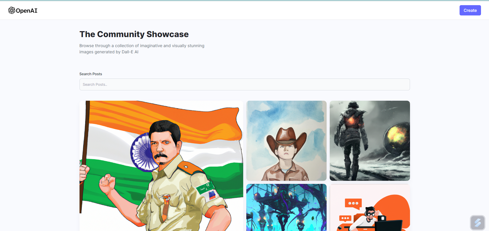
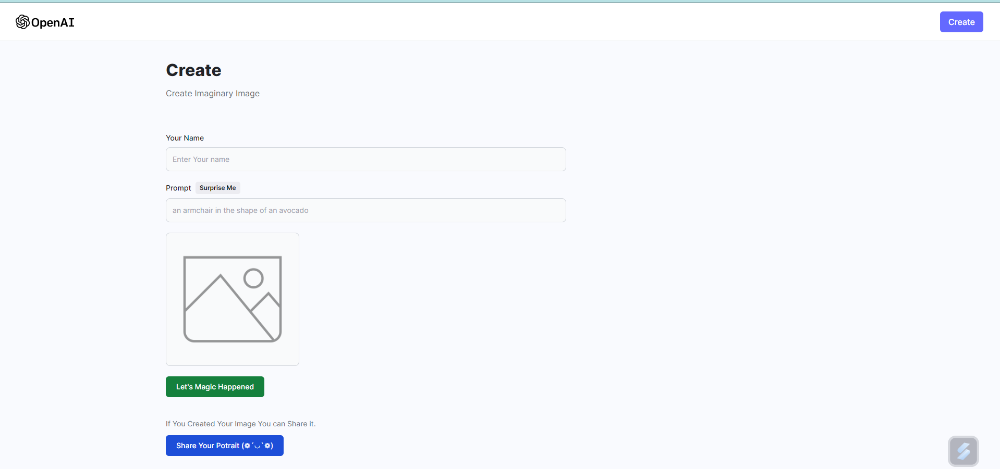

## Open Ai Image Generator

 ## About

This app is Created using **Technologies -:**

 1. Vite
 2. **React**
 3. **Node**
 4. **Tailwind css**
 5. Cloudinary
 6. **Open Ai** 

> How to run start app?

Open Full Web Folder in terminal and run `npm run dev`

> How to start the backend?

Open the Backend Folder and edit the `.env` file  through your open ai api and cloudinary api 
Start Terminal and run `node ./index.js` to start backend 

Now Your Full app is Running on the port `http://localhost:5173/`
 
Preview of Web app

## **Home Page**

## **Post Page**

##						**Thank You**
